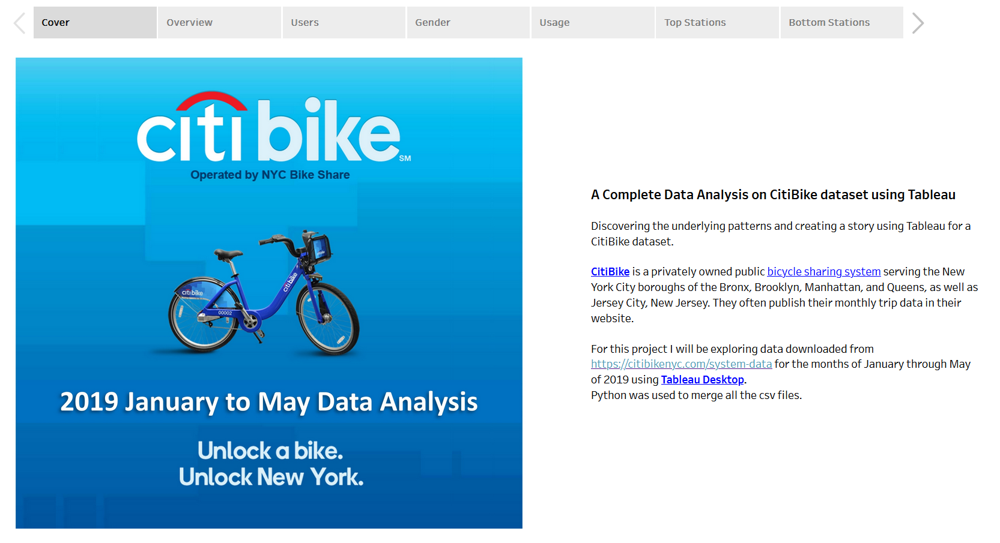
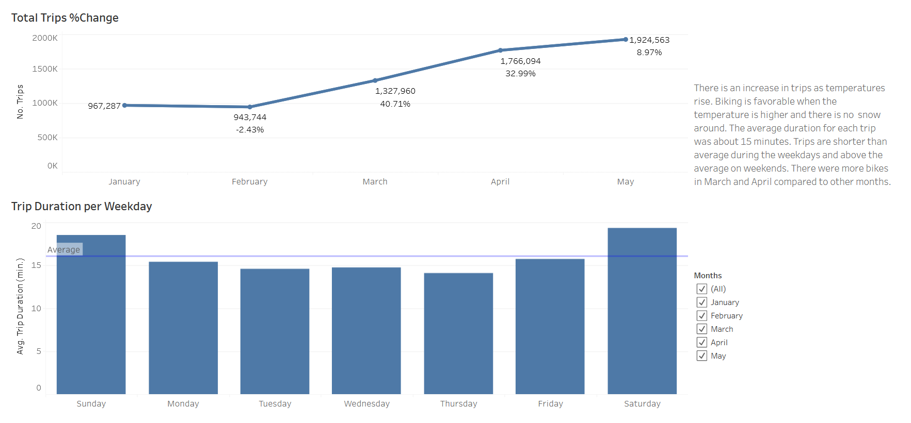
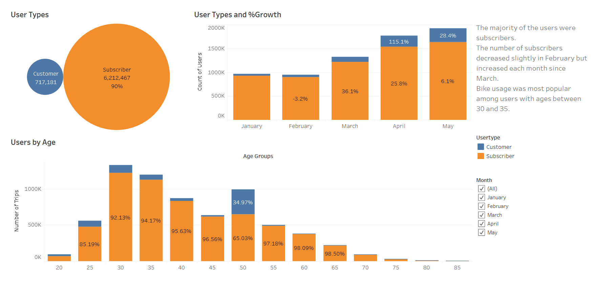
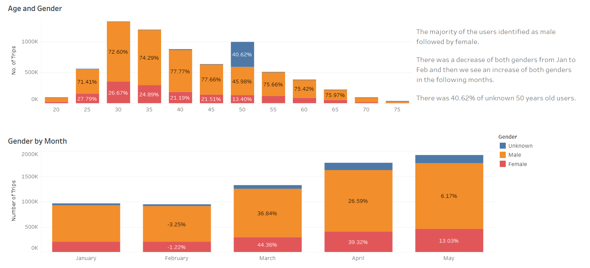
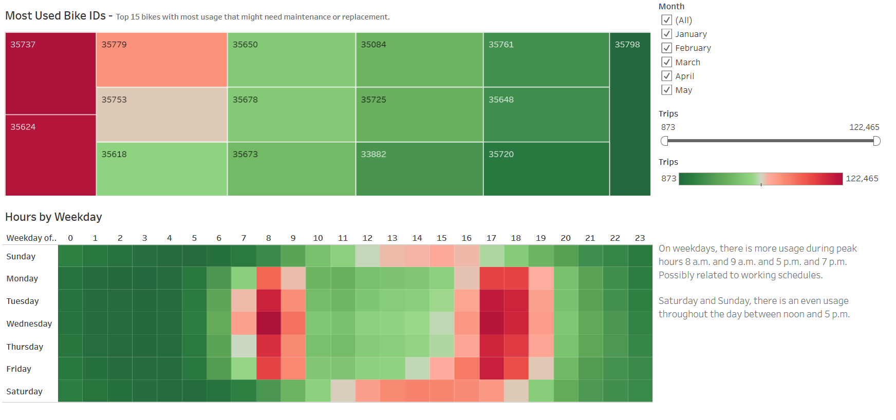

# Complete Data Analysis on CitiBike dataset using Tableau

Project to generate regular reports for city officials looking to publicize and improve the city program.
Since 2013, the CitiBike program has implemented a robust infrastructure for collecting data on the program's utilization. Each mont, bike data is collected, organized, and made public on the [Citi Bike Data](https://www.citibikenyc.com/system-data) webpage.
However, while the data has been regularly updated, the team has yet to implement a dashboard or sophisticated reporting process. City officials have questions about the program, so the first task at hand is to build a set of data reports to provide the answers.

## Purpose 

1. Download data for 2019 Jan to 2019 May.
2. Merge CSV files and prepare data, removing nulls, trips with same start and end station.
3. Import data into Tableau.
4. Create and style worksheets, dashboard, and one story in Tableau.
5. Use Tableau worksheets to display data in a professional way.
6. Visualize data accurately using Tableau Dashboards.

## Link to Tableau Story:

[CitiBike Data Analysis Story](https://public.tableau.com/app/profile/veronica.ostapowich/viz/CitiBikeAnalysis_16803934292920/Story1?publish=yes)

## Review and Clean the Data

Jupyter Notebook and python were used to merge all the CSV files, study and clean the data.

## Results of the Analysis

The CitiBike data can be visualized regarding many aspects. On this project we selected the following main categories for analysis:

1. Overview of the data
2. Data regarding users by type
3. Data regarding trips by gender
4. Data of the most used bikes and usage per hour and weekday
5. Top 10 start & End Stations
6. Bottom 10 start & End Stations

### 1. Overview of the data

* We can observe that there is an increas in trip as temperature rises.
* Biking is favorable when the temperature is higher and there is not snow around.
* The average duration per trip was about 15 minutes.
* Trips are shorter than average during the weekdays and above the average on weekends.
* There were more bikes in March and April comparred to other months.
* This view has a filter so the user can select individual or all the months to compare results.

### 2. Data regarding users by type

* Data from Jan to May of 2019 shows that 90% of the bike users were suscribers and the 10% were customers.
* The number of suscribers decreased 3.2% from Jan to Feb but had a 36.1% increase in March, showing a 25.8% growth in April and only a 6.1% growth in May.
* Riders were popular among ages between 30 and 35.
* We noticed a small number of customers by age group compared to the large number of subscribers, however, the 50 year olds composed 35% of the total number of riders.
* This view has a filter so the user can select individual or all the months to compare results.

### 3. Data regarding trips by gender

* The majority of the users identified as male followed by female, and some didn't select either.
* There was a decrease of both genders from Jan to Feb and then we see an increas of both genders in the following months.
* There was 40.62% of 50 year olds who didn't select either gender.

### 4. Data of the most used bikes and usage per hour and weekday

* This view has a filter so the user can select individual or all the months to compare results.
* Data is visualized to show the most used bike IDs. The top 15 bikes wit most usage that might need maintenance or replacement are in red.
* On weekdays, there is more usage during peak ours 8 a.m. and 9 a.m. and 5 p.m. and 7 p.m. Possibly related to working schedules.
* Saturday and sunday, there is an even usage throughout the day between noon and 5 p.m.

### 5. Top 10 start & End Stations

* Interactive map visualizations show the top 10 most used origins and destinations for riders by month. 
* By selecting All, we can see all the bike stations in that area.
* Pershing Square North is the most popular start and end station followed by several start/end statings along Broadway.
* This view has a filter so the user can select individual months or all the months to compare results.
* The map is divided in sections by zipcode.

### 6. Bottom 10 start & End Stations

* Interactive map visualizations show the bottom 10 less used origins and destinations for riders by month. 
* By selecting All, we can see all the bike stations in that area.
* This view has a filter so the user can select individual months or all the months to compare results.
* The map is divided in sections by zipcode.
* The least popular stations to start a trip are mostly in Brooklyn. 
* The least popular stations to end a trip are in Manhattan. 
* This may suggest that not many users bike across the bridge and mainly use the bike within Manhattan. 

